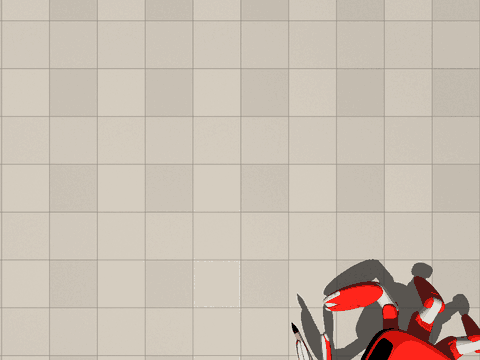

# Jumper

**English** | [简体中文](README.zh.md)

**Jumper is a 22-DoF crab robot.** [View hardware →](docs/HARDWARE.md)

This repo is Jumper’s AI toolkit for appearance, motion, and scene creation. Open this repo in an AI coding assistant and try the prompts below.

> 🦀 **Get a free Jumper!** [Find out how →](https://beunlimited.me/zh/events/crab-robot-challenge-2026)

## This fork: Jumper writes calligraphy · 地书



In Chinese parks people write characters on the paving stones with a long brush
dipped in water — 地书, "ground calligraphy" — and the characters dry and vanish.
This fork teaches Jumper to do the same, in simulation: it holds a brush in its
claw and writes its own name, **跳跳** (*tiàotiào*), and then **你好** (*nǐ hǎo*,
"hello"), stroke by stroke and in stroke order — then steps aside, turns to the
text, dances and bows, and the water dries off the stone.

- **The strokes** come from [Make Me a Hanzi](https://github.com/skishore/makemeahanzi):
  each stroke's median line, smoothed and scaled onto the floor, with a press
  profile — pressed in at the start, lifted towards the end.
- **The arm writes every stroke whole while the body stands still**, the way a
  person writes on a sheet: the robot walks between strokes with the arm folded,
  unfolds it, and the brush — gripped in the shut claw, its black hair as wide as
  the handle and drawn to a point — sinks into the stone to make the stroke
  thicker where it is pressed. The arm
  is moved by inverse kinematics against where the body really is.
- **The legs stand like a statue while the arm writes.** Jumper's five-legged gait
  (`jumper.five_foot`) walks; once it stops, its last command to the legs is held
  until the arm has folded again, so the feet do not shuffle as the arm swings out.
- **Measured** on the film's run: 跳跳 你好 at 12.0 cm a character, 39 strokes;
  the ink is 0.9 mm from the stroke (median, p95 2.5 mm) and two strokes are
  written in two pieces; the claw stays 5 mm off the floor. In a run of the same
  build: a quarter of the hair's length goes into the stone (median; half at
  most), the body moves 0.2 mm while a stroke is written, and no foot comes
  within 6 cm of the ink — the robot stands to the right of what it writes and
  the line goes left to right. Once, finishing a stroke near the body, the claw
  brushes the front of the trunk for half a second.

Try it — nothing to train, no GPU needed to write:

```bash
git clone -b calligraphy https://github.com/AgusBM/jumper && cd jumper
python -m venv .venv && source .venv/bin/activate && pip install -e .
python tasks/jumper/calligraphy/tools/write.py --text "跳跳 你好" --layout horizontal   # ~40 min, 4-core CPU
python tasks/jumper/calligraphy/tools/render.py logs/calligraphy/u8df3-u8df3_u4f60-u597d/<run>
```

`render.py` leaves `film.mp4` and `result.png` in the run's directory (on Linux with
an NVIDIA GPU, `MUJOCO_GL=egl` makes it much faster). Other characters, the options and
everything else — the planner, the controller, the renders and the stroke data for
painting the ink in post-production — are in
[`tasks/jumper/calligraphy/`](tasks/jumper/calligraphy/README.md).

## One sentence to design an appearance

> Design a warm sand ranger appearance for Jumper with coordinated body and limb colors, then export a `.skin`.

| | | |
|:-:|:-:|:-:|
|  |  |  |
| [**Warm sand ranger**](https://github.com/KingKongRobotics/jumper-design/blob/be74e0f2e5e2433d24a3a7b1c1aa0dbeae480356/library/skins/warm-sand-ranger-integrated-v2.skin) | [**Silver armor**](https://github.com/KingKongRobotics/jumper-design/blob/be74e0f2e5e2433d24a3a7b1c1aa0dbeae480356/library/skins/mecha-tripo-v3.skin) | [**Raphael Turtle**](https://github.com/KingKongRobotics/jumper-design/blob/be74e0f2e5e2433d24a3a7b1c1aa0dbeae480356/library/skins/raphael-turtle-v1.skin) |

[Browse all skins](https://github.com/KingKongRobotics/jumper-design/tree/main/library/skins)

## One sentence to train a motion

> Train a stable tripod gait for Jumper, replay and evaluate the result, then package it as an `.app`.

| | | |
|:-:|:-:|:-:|
|  |  |  |
| **Walk** | **Posture** | **Gesture** |
| <br> | <br> | <br> |
| **Dance** | **Jump** | **Grasp** |

## One sentence to create a scene

> Create a park pump-track scene for Jumper with rolling terrain, trees and benches, then export a `.map`.

| | | |
|:-:|:-:|:-:|
|  |  |  |
| [**Park pump track**](https://github.com/KingKongRobotics/jumper-design/blob/be74e0f2e5e2433d24a3a7b1c1aa0dbeae480356/library/maps/park-pump-track.map) | [**Bedroom**](https://github.com/KingKongRobotics/jumper-design/blob/be74e0f2e5e2433d24a3a7b1c1aa0dbeae480356/library/maps/bedroom.map) | [**Soccer**](https://github.com/KingKongRobotics/jumper-design/blob/be74e0f2e5e2433d24a3a7b1c1aa0dbeae480356/library/maps/soccer.map) |

[Browse all maps](https://github.com/KingKongRobotics/jumper-design/tree/main/library/maps)

## Where to find things

| Resource | Purpose |
|---|---|
| [jumper-design](https://github.com/KingKongRobotics/jumper-design) | Appearance and scene creation; your assistant reads its [instructions](https://github.com/KingKongRobotics/jumper-design/blob/main/AGENTS.md) and uses its tools as needed. |
| [Training tutorial](docs/TUTORIAL.md) | Motion training, replay and policy export in this repository. |
| [Motion bundles](deploy/BUNDLE.md) | Package trained motions and their controller as an `.app`; see the [build guide](deploy/README.md) for prerequisites. |
| [Project guide](docs/PROJECT_GUIDE.md) | Setup, current capabilities and further documentation. |

Training builds on [mjlab](https://github.com/mujocolab/mjlab),
[rsl_rl](https://github.com/leggedrobotics/rsl_rl), [MuJoCo](https://github.com/google-deepmind/mujoco)
and [MuJoCo Warp](https://github.com/google-deepmind/mujoco_warp).
Example appearance and scene images come from jumper-design; [image sources](docs/media/DESIGN_SOURCES.md)
and [third-party notices](NOTICE) record attribution.

## License

Copyright 2026 KingKong Robotics.

Maintainer-owned project materials are licensed under Apache-2.0. See [LICENSE](LICENSE),
[NOTICE](NOTICE), and [licensing details](docs/PROJECT_GUIDE.md#license).
Third-party materials remain under their respective terms, and generated outputs do not
automatically inherit this repository's license.
